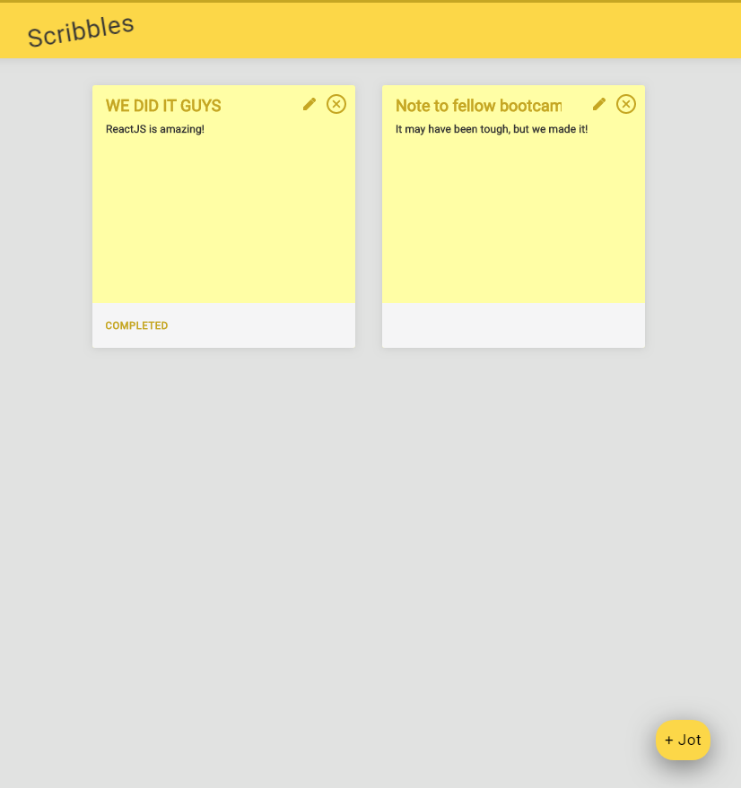
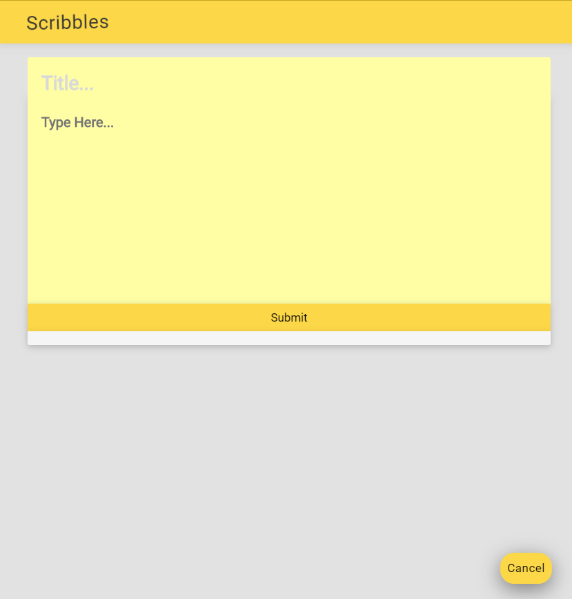
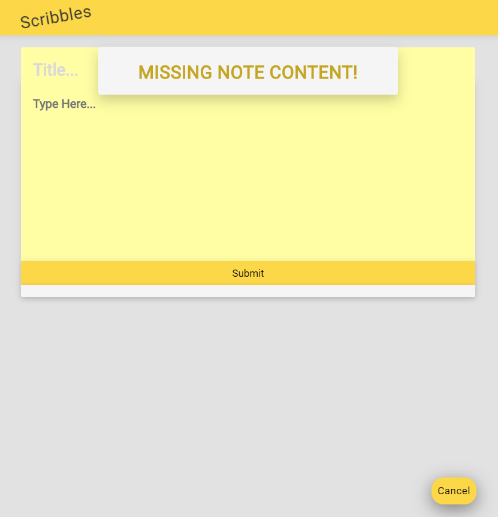
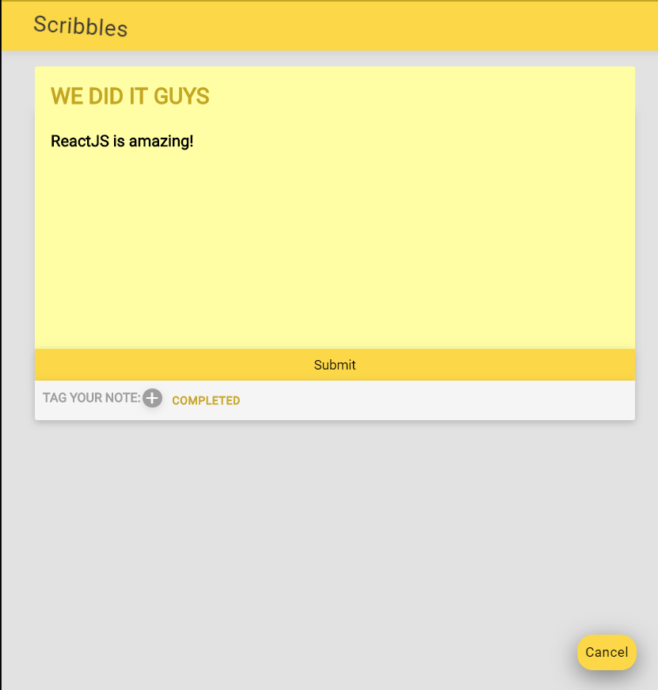
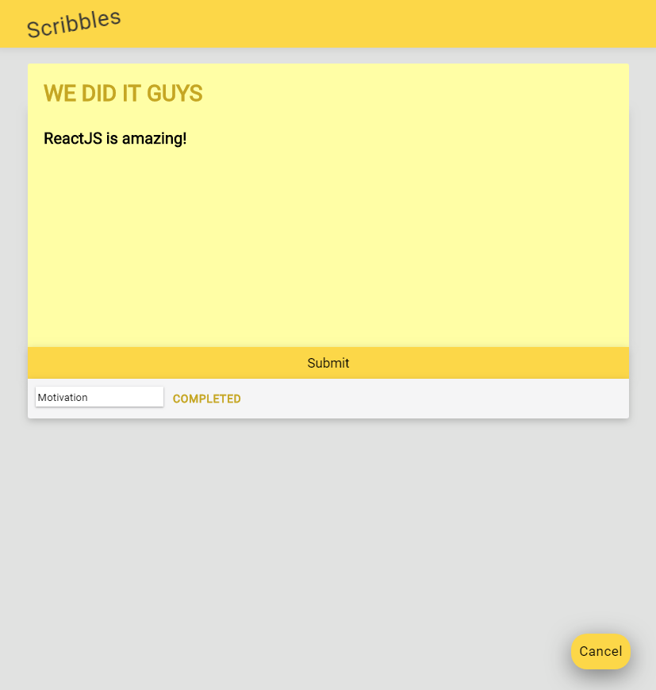
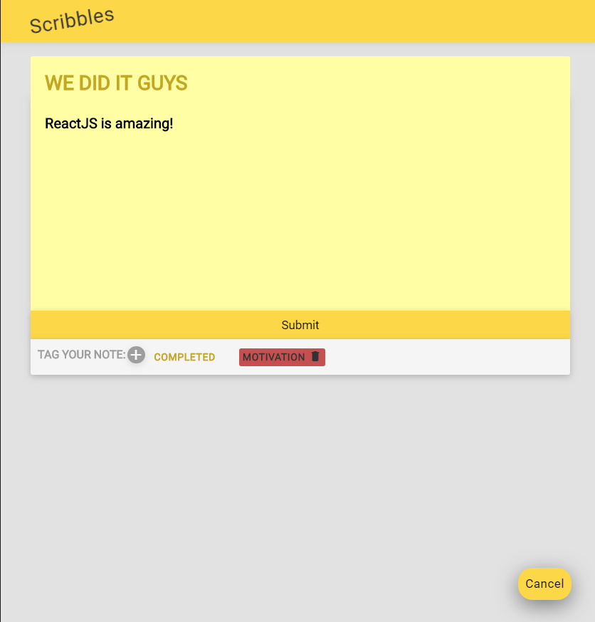
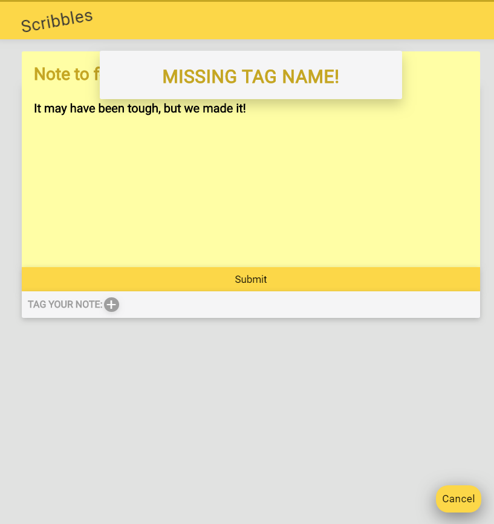

# README

Scribbles is a note-taking app with a fluid user interface.  It is written in ReactJS and bootstrapped with [Create React App](https://github.com/facebook/create-react-app).  Scribbles is composed of two applications: the front-end React application, which consists of assets such as images, CSS, and JavaScript code, and the back-end Rails API, which renders JSON and interacts with the front-end.

See it in action <a href="https://scribbles-winnie-khuu.herokuapp.com">here</a>.

## TECHNOLOGIES USED
* HTML
* CSS
* ReactJS
* Vagrant
* PuTTY
* Atom

## SEE IT LOCALLY

1. Download the repository and unzip the files.
2. In your preferred coding environment, navigate to the folder `cd XXXXX/scribbles-master`
3. Visit your localhost link (i.e. localhost:3030 or localhost:3000) in your browser.

## Screenshots

Home page with all notes

Create new note by clicking +Jot on home page

If you press Submit without any content, it will flash an error message for 2 seconds

Edit note

Add a tag at the bottom of the note by entering text and pressing Enter

Hover over tag and click to delete tag

If you try to enter a blank tag name, it will flash an error message for 2 seconds
